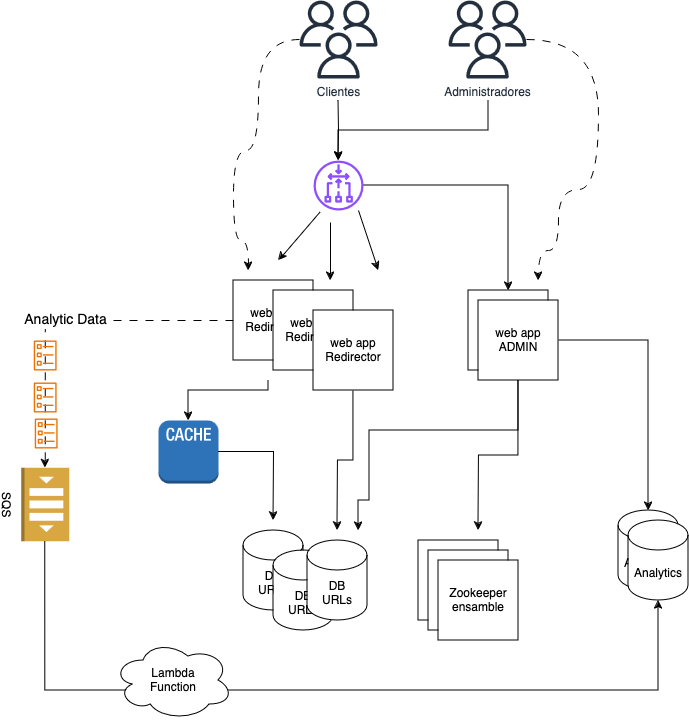

# URL Shortener 🔗

## Descripción del Proyecto 📝

Este proyecto implementa un sistema de acortamiento de URLs con los siguientes requerimientos funcionales y no funcionales:

### Requerimientos Funcionales 🛠️

- El sistema debe permitir acortar una URL larga en una URL corta.
- El sistema debe permitir redirigir una URL corta a la URL larga original.
- El sistema almacena información sobre el tráfico de las URLs cortas.
- El sistema debe permitir eliminar una URL corta.

### Requerimientos No Funcionales 🔍

- El sistema debe ser altamente disponible.
- La creación de una URL corta debe ser rápida, en menos de 1 segundo.
- La redirección de una URL corta debe ser rápida, en menos de 10 milisegundos en el 90% de los casos.
- El sistema debe soportar un tráfico de redirección de 50.000 peticiones por segundo.

## Cómo Ejecutar el Proyecto 🚀

### Requisitos
- Docker
- Docker Compose

### Pasos
1. Clona el repositorio.
2. Ejecuta el comando `docker-compose up` en el directorio `infra`.
3. Utiliza la aplicación Postman para cargar la colección de solicitudes ubicada en la carpeta `api-collection` del proyecto.

### ¿Qué Levanta el Comando `docker-compose up`? 🐳

- Tres contenedores con la aplicación de Administración de URLs (admin-app-{1,2,3}}) servida por Gunicorn en el puerto 8000.
- Tres contenedores con la aplicación de Redirección de URLs (redirector-app-{1,2,3}) servida por Gunicorn en el puerto 8080.
- Un contenedor con Redis en el puerto 6379.
- Un contenedor con DynamoDB en el puerto 9000 (:warning: no es el 8000).
- Un contenedor con ElasticMQ en el puerto 9324.
- Un contenedor con Zookeeper en el puerto 2181.
- Un contenedor con Nginx en el puerto 80, cuya configuración se encuentra en el archivo `infra/nginx.lb.conf`.

Nota: Para los casos en los que se requiere persistencia de datos, se utilizan volúmenes de Docker.

## Arquitectura 🏗️

### Diagrama de Arquitectura

## Stack Tecnológico 🛠️

- Python 3.9 como lenguaje de programación
- Flask 3.x como framework web
- Redis como Cache
- DynamoDB como base de datos NoSQL
- elasticmq como simulador de SQS
- AWS SDK (Boto3)
- Zookeeper para asegurar la alta disponibilidad del servicio y la unicidad al generar claves de las URLs cortas
- Nginx como servidor web y balanceador de carga
- guinicorn como servidor de aplicaciones WSGI
- Docker
- Docker Compose

## Decisiones de Diseño 🧠

### Base de Datos
Se optó por DynamoDB como base de datos NoSQL por su escalabilidad y alta disponibilidad.

### Cache
Se optó por Redis como cache para almacenar las URLs cortas y sus respectivas URLs largas.

### Cola de Mensajes
Se optó por elasticmq como simulador de SQS para almacenar los eventos de redirección de URLs cortas. De esta forma, se garantiza la alta disponibilidad del sistema y se evita la pérdida de eventos.
Además, ElasticMQ es una herramienta que permite simular el servicio de SQS de AWS de forma local, utilizando el mismo SDK de AWS (Boto3).

### Arquitectura
Se optó por una arquitectura de microservicios, donde cada servicio tiene una responsabilidad específica. De esta forma, se garantiza la escalabilidad y la alta disponibilidad del sistema.
